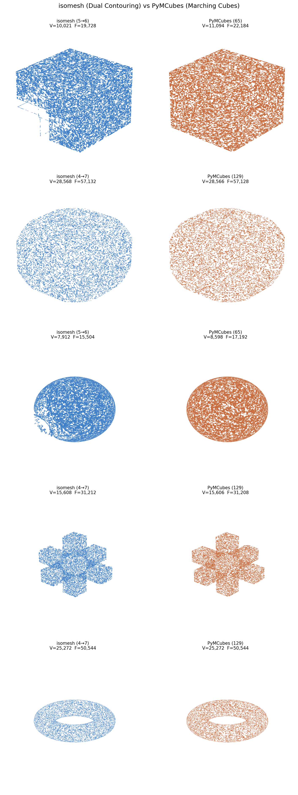
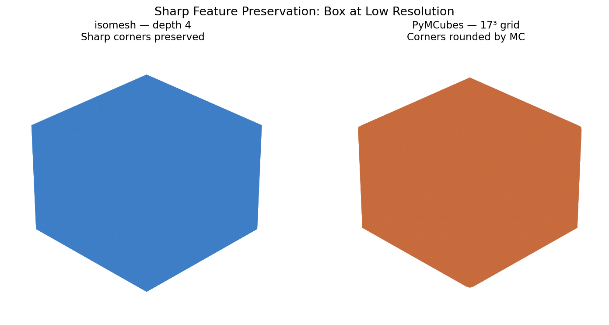

# isomesh

Fast, robust isosurface extraction from arbitrary implicit functions using adaptive octree and Dual Contouring.



## Features

- **Sharp feature preservation** via QEF (Quadric Error Function) vertex placement -- corners and edges are captured exactly, not rounded like Marching Cubes
- **Manifold, watertight output** guaranteed for closed surfaces
- **Adaptive refinement** -- concentrates cells at feature boundaries, smooth regions stay coarse
- **Rust core** with Python bindings (PyO3 + maturin) -- zero-copy numpy array exchange
- **Batch evaluation** -- the user's implicit function is called with `(N, 3)` arrays, not point-by-point
- **Newton surface projection** -- all vertices lie exactly on the isosurface (machine precision)

## Quick Start

```python
import isomesh
import numpy as np

def sdf_sphere(pos: np.ndarray):
    norms = np.linalg.norm(pos, axis=1)
    values = norms - 1.0
    gradients = pos / np.linalg.norm(pos, axis=1, keepdims=True)
    return values, gradients

vertices, faces = isomesh.extract(
    func=sdf_sphere,
    bbox_min=(-2, -2, -2),
    bbox_max=(2, 2, 2),
    min_depth=4,
    max_depth=7,
    angle_threshold=30.0,   # degrees -- sharp feature detection
    iso_value=0.0,
)

# vertices: (V, 3) float64 -- all on the isosurface
# faces: (F, 3) int64 -- consistently oriented triangles
```

## Installation

Requires Python >= 3.11 and a Rust toolchain.

```bash
pip install maturin
git clone <repo-url> && cd isomesh
maturin develop --release
```

## How It Works

isomesh uses **Dual Contouring** on an adaptive octree:

1. **Adaptive octree construction** -- uniform grid at `min_depth`, then feature-sensitive refinement to `max_depth` based on normal angle spread and gradient variation
2. **QEF vertex placement** -- one vertex per cell via Jacobi SVD eigendecomposition with mass-point bias for rank-deficient cases
3. **Newton surface projection** -- one Newton step projects each vertex exactly onto the zero-isosurface
4. **Quad generation** -- canonical-edge iteration with flatness-based triangulation
5. **All surface leaves forced to `max_depth`** -- eliminates T-junction holes, guarantees watertight output

### Function Interface

The implicit function must be vectorized:

```python
def f(positions: np.ndarray) -> tuple[np.ndarray, np.ndarray | None]:
    """
    Args:
        positions: (N, 3) float64 array of query points
    Returns:
        values: (N,) float64 -- implicit function values
        gradients: (N, 3) float64 or None -- if None, estimated via finite differences
    """
```

## isomesh vs PyMCubes

### Sharp Feature Preservation

At low resolution, the difference is stark. Dual Contouring places vertices at geometric feature intersections via QEF, while Marching Cubes rounds them by linear interpolation on edges.



| Metric | isomesh (DC) | PyMCubes (MC) |
|--------|:-----------:|:-------------:|
| Box corner distance | **0.0000** | 0.0884 |
| Box edge distance | **0.005** | 0.075 |

### Surface Accuracy

Newton projection places all vertices exactly on the isosurface:

| Metric (depth 7) | isomesh | PyMCubes |
|-------------------|:-------:|:--------:|
| Sphere Hausdorff | **0.000000** | 0.000068 |
| Chamfered box max \|SDF\| | **0.000000** | 0.000000 |

### Performance

Adaptive refinement evaluates the function only near the surface and at feature boundaries:

| Shape (depth 7 quality) | isomesh (adaptive) | PyMCubes (uniform) |
|-------------------------|:------------------:|:------------------:|
| Chamfered box | 0.145s | 0.115s |
| Sphere | 0.066s | 0.057s |

At equivalent resolution, speeds are comparable. isomesh's advantage is that adaptive refinement achieves depth-7 quality with depth-4 evaluation cost -- **26x faster** than uniform depth 7.

### Mesh Quality

All closed shapes produce manifold, watertight meshes with consistent face winding:

| Shape | Manifold | Watertight | Euler |
|-------|:--------:|:----------:|:-----:|
| Sphere | Y | Y | 2 |
| Box | Y | Y | 2 |
| Torus | Y | Y | 0 |
| Chamfered box | Y | Y | 2 |
| CSG cross | Y | Y | 2 |

## API Reference

```python
isomesh.extract(
    func,                    # vectorized SDF: (N,3) -> ((N,), (N,3)|None)
    *,
    bbox_min=(-1, -1, -1),   # bounding box (expanded to cube if non-cubic)
    bbox_max=(1, 1, 1),
    min_depth=3,             # uniform base resolution (2^min_depth cells/axis)
    max_depth=7,             # max adaptive refinement depth
    angle_threshold=30.0,    # degrees -- feature detection sensitivity
    iso_value=0.0,           # isosurface level
    fd_step=1e-5,            # finite difference step (if gradients not provided)
) -> (vertices, faces)
```

## Architecture

```
src/                        # Rust core
  lib.rs                    # PyO3 module entry
  bbox.rs                   # Bounding box, expand-to-cubic
  octree/                   # Adaptive octree
    build.rs                # Construction + feature-sensitive refinement
    cell.rs, types.rs       # Data structures
    morton.rs               # Morton code spatial indexing
  eval/                     # Function evaluation bridge
    bridge.rs               # Batch Python<->Rust with GIL management
    cache.rs                # Corner value/gradient cache
  dc/extract.rs             # Dual Contouring mesh extraction
  qef/quadric.rs            # QEF solver (Jacobi SVD, mass-point bias)
  util/math.rs              # 3x3 eigendecomposition

python/isomesh/             # Python API
  _core.py                  # extract() wrapper + validation
  _validation.py            # Input checking with clear error messages
```

## Testing

```bash
# Run all tests
maturin develop --release
pytest tests/ -v

# 80 tests: 16 Rust unit tests + 64 Python integration tests
# Covers: sphere, box, torus, chamfered box, CSG, thin features,
#         manifold/watertight validation, Hausdorff accuracy, API contracts
```

## Benchmark Shapes

The benchmark suite includes 16 shapes across 5 categories:

| Category | Shapes |
|----------|--------|
| Basic analytic | Sphere, Torus, Ellipsoid |
| Sharp features | Box, CSG cross, CSG intersection, Chamfered box |
| TPMS | Gyroid, Schwarz P, Schwarz D |
| Complex topology | Genus-2, Tanglecube, Heart, Barth sextic |
| Thin features | Thin plate, Thin shell |

```bash
python benchmarks/run_benchmark.py      # full benchmark suite
python benchmarks/compare_visual.py     # visual comparison renders
```

## References

- Ju, Losasso, Schaefer, Warren. "Dual Contouring of Hermite Data." SIGGRAPH 2002.
- Schaefer, Ju, Warren. "Manifold Dual Contouring." IEEE TVCG 13(3), 2007.
- Garland, Heckbert. "Surface Simplification Using Quadric Error Metrics." SIGGRAPH 1997.
- Lindstrom. "Out-of-Core Simplification of Large Polygonal Models." SIGGRAPH 2000.

## License

MIT
