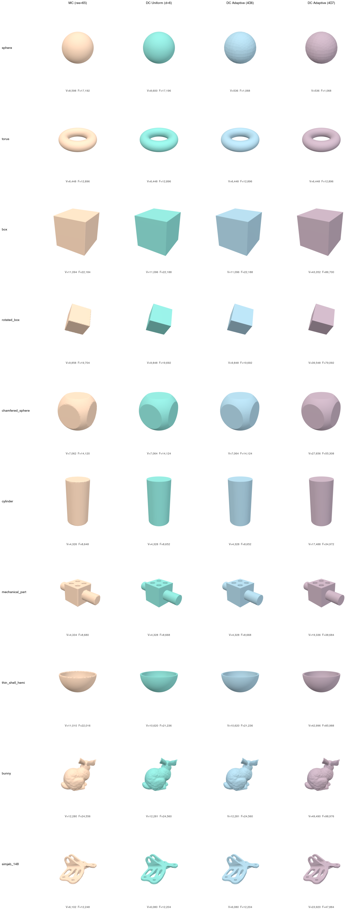
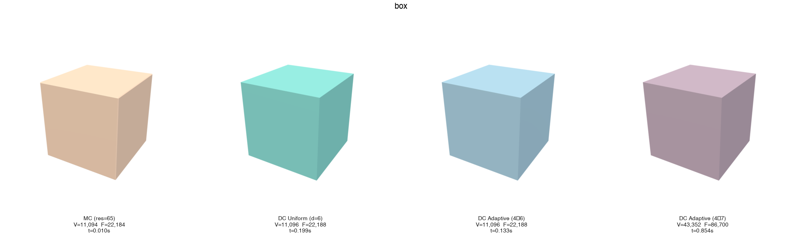
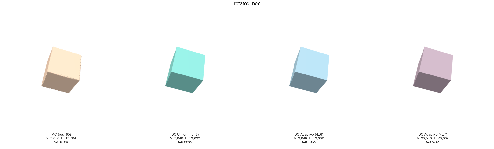
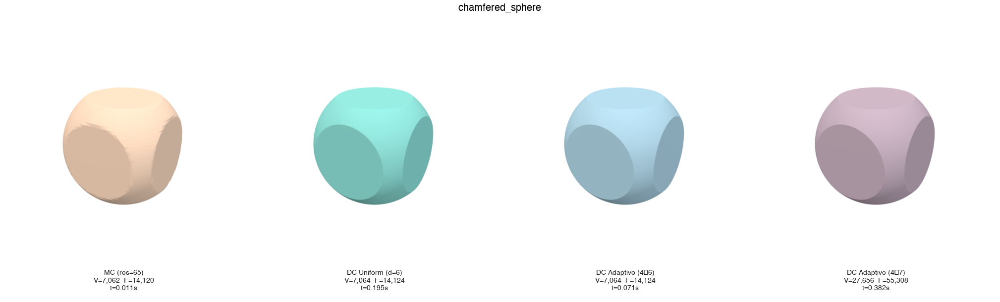
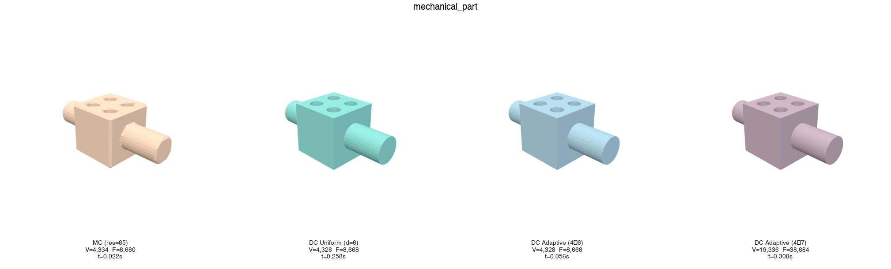
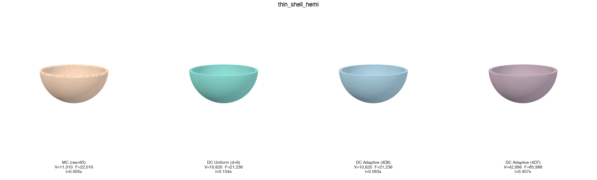
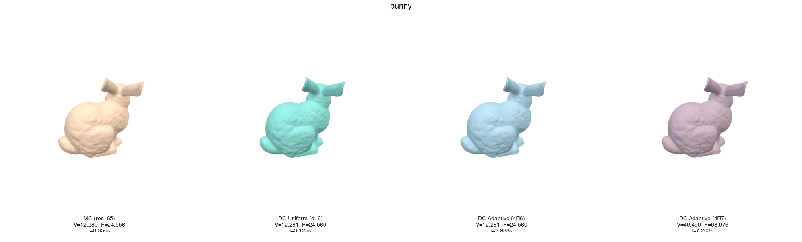
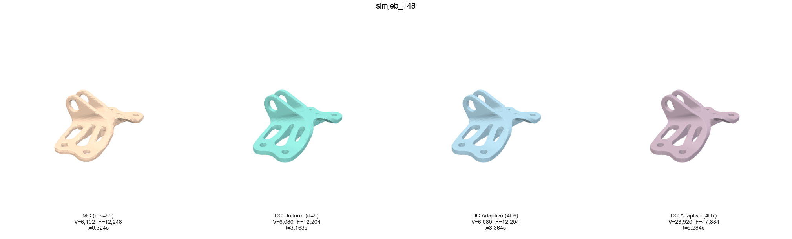

# isomesh

Fast, robust isosurface extraction from arbitrary implicit functions using adaptive octree and Dual Contouring.



## Features

- **Sharp feature preservation** via QEF (Quadric Error Function) vertex placement -- corners and edges are captured exactly, not rounded like Marching Cubes
- **Manifold, watertight output** guaranteed for closed surfaces
- **Adaptive refinement** -- concentrates cells at feature boundaries, smooth regions stay coarse
- **Rust core** with Python bindings (PyO3 + maturin) -- zero-copy numpy array exchange
- **Batch evaluation** -- the user's implicit function is called with `(N, 3)` arrays, not point-by-point
- **Newton surface projection** -- all vertices lie exactly on the isosurface (machine precision)

## Quick Start

```python
import isomesh
import numpy as np

def sdf_sphere(pos: np.ndarray):
    norms = np.linalg.norm(pos, axis=1)
    values = norms - 1.0
    gradients = pos / np.linalg.norm(pos, axis=1, keepdims=True)
    return values, gradients

vertices, faces = isomesh.extract(
    func=sdf_sphere,
    bbox_min=(-2, -2, -2),
    bbox_max=(2, 2, 2),
    min_depth=4,
    max_depth=7,
    angle_threshold=30.0,   # degrees -- sharp feature detection
    iso_value=0.0,
)

# vertices: (V, 3) float64 -- all on the isosurface
# faces: (F, 3) int64 -- consistently oriented triangles
```

## Installation

Requires Python >= 3.11 and a Rust toolchain.

```bash
pip install maturin
git clone <repo-url> && cd isomesh
maturin develop --release
```

## How It Works

isomesh uses **Dual Contouring** on an adaptive octree:

1. **Adaptive octree construction** -- uniform grid at `min_depth`, then feature-sensitive refinement to `max_depth` based on normal angle spread and gradient variation
2. **QEF vertex placement** -- one vertex per cell via Jacobi SVD eigendecomposition with mass-point bias for rank-deficient cases
3. **Newton surface projection** -- one Newton step projects each vertex exactly onto the zero-isosurface
4. **Quad generation** -- canonical-edge iteration with flatness-based triangulation
5. **All surface leaves forced to `max_depth`** -- eliminates T-junction holes, guarantees watertight output

### Function Interface

The implicit function must be vectorized:

```python
def f(positions: np.ndarray) -> tuple[np.ndarray, np.ndarray | None]:
    """
    Args:
        positions: (N, 3) float64 array of query points
    Returns:
        values: (N,) float64 -- implicit function values
        gradients: (N, 3) float64 or None -- if None, estimated via finite differences
    """
```

## Dual Contouring vs Marching Cubes

Comprehensive comparison across 10 benchmark shapes using isomesh (Dual Contouring) and PyMCubes (Marching Cubes) at equivalent resolution (depth 6 = 64 cells/axis).

### Summary

| Metric | MC (res=65) | DC Uniform (d=6) | DC Adaptive (4->6) | DC Adaptive (4->7) |
|--------|:-----------:|:-----------------:|:-------------------:|:-------------------:|
| Manifold | 10/10 | 10/10 | 10/10 | 10/10 |
| Watertight | 10/10 | 10/10 | 10/10 | 10/10 |
| Total vertices | 81,112 | 80,693 | 72,629 | 270,770 |
| Total time | 0.75s | 7.69s | 6.86s | 15.25s |
| Avg SDF error | 3.10e-04 | 5.74e-05 | 5.75e-05 | 2.17e-05 |
| Avg min angle | 34.7 | 39.8 | 39.6 | 40.0 |

### Surface Accuracy

Newton projection places DC vertices nearly exactly on the isosurface:

| Shape | MC mean |SDF| | DC mean |SDF| | Improvement |
|-------|:-------:|:-------:|:----------:|
| sphere | 9.63e-05 | **1.21e-18** | ~10^13x |
| thin_shell_hemi | 6.86e-05 | **1.17e-11** | ~10^6x |
| chamfered_sphere | 2.58e-04 | **5.12e-07** | ~500x |
| mechanical_part | 3.25e-04 | **4.05e-05** | ~8x |
| bunny | 4.38e-04 | **4.38e-04** | ~1x |
| simjeb_148 | 1.35e-03 | **8.95e-05** | ~15x |

### Triangle Quality

DC consistently produces better-shaped triangles (higher minimum angle = less degenerate):

| Shape | MC min angle (avg) | DC min angle (avg) |
|-------|:--:|:--:|
| sphere | 31.6 | **43.7** |
| thin_shell_hemi | 31.4 | **43.1** |
| chamfered_sphere | 35.5 | **43.4** |
| box | 44.1 | **44.5** |
| mechanical_part | 40.3 | **41.0** |
| bunny | 32.3 | **30.9** |
| simjeb_148 | 34.6 | **33.2** |

### Sharp Feature Comparison

DC (Dual Contouring) preserves sharp edges and corners via QEF vertex placement. MC (Marching Cubes) rounds them by linear interpolation.






### Thin Feature & Complex Geometry





### Adaptive Refinement

Adaptive mode concentrates resolution where needed:

| Shape | Adaptive (4->6) V | Uniform (d=6) V | Ratio |
|-------|---:|---:|:----:|
| sphere | 536 | 8,600 | **16x fewer** |
| chamfered_sphere | 7,064 | 7,064 | 1x |
| cylinder | 4,328 | 4,328 | 1x |

For smooth shapes like sphere, adaptive refinement skips unnecessary subdivision, reducing vertex count by 16x with comparable accuracy.

## API Reference

```python
isomesh.extract(
    func,                    # vectorized SDF: (N,3) -> ((N,), (N,3)|None)
    *,
    bbox_min=(-1, -1, -1),   # bounding box (expanded to cube if non-cubic)
    bbox_max=(1, 1, 1),
    min_depth=3,             # uniform base resolution (2^min_depth cells/axis)
    max_depth=7,             # max adaptive refinement depth
    angle_threshold=30.0,    # degrees -- feature detection sensitivity
    iso_value=0.0,           # isosurface level
    fd_step=1e-5,            # finite difference step (if gradients not provided)
    adaptive=False,          # enable adaptive refinement
) -> (vertices, faces)
```

## Architecture

```
src/                        # Rust core
  lib.rs                    # PyO3 module entry
  bbox.rs                   # Bounding box, expand-to-cubic
  octree/                   # Adaptive octree
    build.rs                # Construction + feature-sensitive refinement
    cell.rs, types.rs       # Data structures
    morton.rs               # Morton code spatial indexing
  eval/                     # Function evaluation bridge
    bridge.rs               # Batch Python<->Rust with GIL management
    cache.rs                # Corner value/gradient cache
  dc/extract.rs             # Dual Contouring mesh extraction
  qef/quadric.rs            # QEF solver (Jacobi SVD, mass-point bias)
  util/math.rs              # 3x3 eigendecomposition

python/isomesh/             # Python API
  _core.py                  # extract() wrapper + validation
  _validation.py            # Input checking with clear error messages
```

## Testing

```bash
maturin develop --release
pytest tests/ -v
```

## Benchmarks

The benchmark suite compares isomesh against PyMCubes across 10 shapes in 4 categories:

| Category | Shapes | What it tests |
|----------|--------|---------------|
| Basic | Sphere, Torus | Smooth surfaces, analytic ground truth |
| Sharp features | Box, Rotated box, Chamfered sphere, Cylinder, Mechanical part | Sharp edges, corners, non-axis-aligned edges, CSG operations |
| Thin features | Hemisphere shell (wall=0.08) | Thin walls, open boundaries |
| Complex geometry | Bunny, SimJEB 148 (mesh-based SDF) | Real CAD parts, complex topology |

```bash
# Full benchmark (all shapes, all methods, with rendering)
uv run python benchmarks/run_benchmark.py

# Selective
uv run python benchmarks/run_benchmark.py --shapes sphere box chamfered_sphere
uv run python benchmarks/run_benchmark.py --methods uniform adaptive
uv run python benchmarks/run_benchmark.py --no-render --no-stl
```

## References

- Ju, Losasso, Schaefer, Warren. "Dual Contouring of Hermite Data." SIGGRAPH 2002.
- Schaefer, Ju, Warren. "Manifold Dual Contouring." IEEE TVCG 13(3), 2007.
- Garland, Heckbert. "Surface Simplification Using Quadric Error Metrics." SIGGRAPH 1997.
- Lindstrom. "Out-of-Core Simplification of Large Polygonal Models." SIGGRAPH 2000.

## License

MIT
